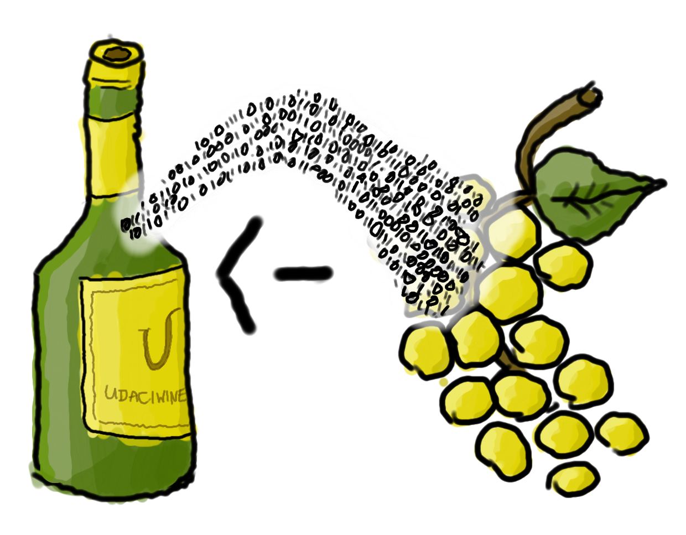

This paper explores which chemical components influence wine quality
with the method of 'Exploratory Data Analysis' using the R programming
language. It is part of Udacity Data Analyst Nanodegree. It is written
as an R-Markdown file and provides a stream-of-contiousness analysis
of the data as well as a 'Final Plots' section at the end which is
somewhat more cut-to-the-chase.

In the data set at hand, about 5000 white wines are scored by
professionals (0 being bad, 10 being excellent) and the chemical
properties are recorded. After doing some preparations and loading
the data set, we will go through each variable one-by-one.

# Preparations

First, we load libraries and define some functions to achieve a unique
'look and feel' and some shortcuts for the plotting styles most commonly
used in this project.

```{r preparations, warning=FALSE, message=FALSE}
library(ggplot2) # plotting 
library(gridExtra) # arranging multiple plots in one figure
library(grid) 
library(tidyr) # cleaning & data re-shaping
library(dplyr)
library(scales) # advanced manipulating of axes and color indicators
library(GGally) # scatterplot matrixes

# Helper function to create a beautiful ggplot2 histogram object
ggplot_hist <- function(data, x, binwidth, xlab="", title="", xscale=NA,
      ylab="", fill=NA, median=T, facet=NA, ncol=1, nrow=1,
      coordflip=F, fillname=NA) {
  # Environment is needed for proper evaluation of eas wrapper in context
  # of variables supplied to this function
  e <- environment()
  # Standard ggplot2 object with or without color facetting
  if (!is.na(fill))
    p <- ggplot(data=data, aes(x=data[,x], fill=data[,fill]), environment=e)
    if (!is.na(fillname))
      p <- p + scale_fill_discrete(name=fillname)
  else
    p <- ggplot(data=data, aes(x=data[,x]), environment=e)
  # Histogram with labels and title
  p <- p + 
      geom_histogram(binwidth=binwidth, alpha=0.5, position='identity') + 
      labs(x=xlab, y=ylab) + ggtitle(title)
  # Add marker for median if requested
  if (median == T)
    p <- p + geom_vline(x=mean(data[,x]))
  # Set scaling and breaks on axes if requested
  if (length(xscale) == 3) 
    p <- p + scale_x_continuous(limits = xscale[1:2],
                                breaks = seq(xscale[1], xscale[2], xscale[3]))
  # Flip coords if requested
  if (coordflip == T)
    p <- p + coord_flip()
  # Facet with number of rows / columns, if requested
  if (!is.na(facet))
    p <- p + facet_wrap(facet, ncol=ncol, nrow=nrow)
  # Return for potential further processing
  return(p)
}

# Function to plot histograms with a second view showing rel. frequency
# and normal curve overlay
ggplot_normdist <- function(data, x, binwidth, xlab, title, xscale=NA, ylab) {
  # Environment is needed for proper evaluation of eas wrapper in context
  # of variables supplied to this function
  e <- environment()
  # Normal curve overlay
  p1 <- ggplot(data=data, aes(x=data[,x]), environment=e) +
    # Histogram with density variable (gives relative frequencies)
    geom_histogram(aes(y = ..density..), binwidth=binwidth, alpha = 0.2) + 
    # Add normal curve overlay
    stat_function(geom="line", fun=dnorm, arg=list(mean=mean(data[,x]),
                                                   sd=sd(data[,x]))) + 
    # Add marker for mean
    geom_vline(x=mean(data[,x])) + 
    # No x-axis (shown by main plot)
    theme(axis.ticks.x = element_blank(), axis.text.x = element_blank()) +
    # Fixed label for y-axis, x-label given by parameter
    labs(y="Relative Frequency", x=xlab) + 
    # Manipulate margins to "attach" to below main graph
    theme(plot.margin = unit(c(15,5,-20,6), unit="points"),
          axis.title.y = element_text(vjust =0.25)) +
    ggtitle(title)
  # Change scale of x-axis, if requested
  if (length(xscale) == 3) 
    p1 <- p1 + scale_x_continuous(limits = xscale[1:2],
                                  breaks = seq(xscale[1], xscale[2], xscale[3]))
  # Main plot below is a standard histogram as given by ggplot_hist helper
  p2 <- ggplot_hist(data, x, binwidth, xlab, "", xscale, ylab) + 
    # but we need to modify the margin to fit it together with the plot above
    theme(plot.margin = unit(c(0,5,1,1), unit="points"))
  grid.arrange(p1, p2, heights=c(0.2,0.4))
}

# Function to create a scatter plot to examine for corellation
ggplot_corr <- function(data, x, y, xlab, ylab, xscale=NA, yscale=NA, title) {
  # Environment is needed for proper evaluation of eas wrapper in context
  # of variables supplied to this function
  e <- environment()
  # Jittered scatterplot with alpha = 0.1
  p <- ggplot(data=data, aes(x=data[,x], y=data[,y]), environment=e) + 
          geom_jitter(alpha=0.1) + 
          # Linear Smoother to examine corellation
          stat_smooth(geom = "smooth", method = "lm") +
          # Labels & Title
          labs(x=xlab, y=ylab)  + 
          ggtitle(title)
  # Scale x axis if required
  if (length(xscale) == 3)
    p <- p + scale_x_continuous(limits = xscale[1:2],
                                breaks = seq(xscale[1], xscale[2], xscale[3]))
  # Scale y axis if required
  if (length(yscale) == 3)
    p <- p + scale_y_continuous(limits = yscale[1:2],
                                breaks = seq(yscale[1], yscale[2], yscale[3]))
  return(p)
}

# Function to create a bunch of horizontally stacked box plots
ggplot_boxplot <- function(data, x, y, xlab="", title="", yscale=NA, ylab="",
      facet=NA, ncol=1, nrow=1, smooth=T, fill=NA, fillname="") {
  # Environment is needed for proper evaluation of eas wrapper in context
  # of variables supplied to this function
  e <- environment()
  # Filled box plots (or not)
  if (!is.na(fill))
    p <- ggplot(data=data, aes(x=data[,x], y=data[,y], fill=data[,fill]),
                environment=e) + 
      scale_fill_discrete(name=fillname)
  else
    p <- ggplot(data=data, aes(x=data[,x], y=data[,y]), environment=e)
  p <- p + geom_boxplot(position='dodge') +
          labs(x=xlab, y=ylab) + ggtitle(title)
  # Add smoother between horizontally stacked box plots if required
  if (smooth == T)
    p <- p + geom_smooth(method="lm", aes(group=1))
  # Scale y-axis if required
  if (length(yscale) == 3) 
    p <- p + scale_y_continuous(limits = yscale[1:2],
                                breaks = seq(yscale[1], yscale[2], yscale[3]))
  # Facet plots horizontally / vertically
  if (!is.na(facet))
    p <- p + facet_wrap(facet, ncol=ncol, nrow=nrow)
  return(p)
}

```

# First Observations

We load the data and assess its structure:

```{r load data}
# load data
setwd("h:/Dokumente/GitHub/2015_Data_Analyst_Project_4/")
wine <- read.csv("project/wineQualityWhites.csv")
# read and display data structure
str(wine)
dim(wine)
```

Seems like no addtitional post-processing will be necessary. ```quality``` may
be more useful as a factor in certain use cases (we will keep this in mind).
We can also see, that there are 4898 observations and 15 variables.

Let's look at the distribution of the key chemical parameters one-by-one
by plotting their distribution and their statistical (```summary(...)```)
properties.

## Fixed Acidity (Tartaric Acid) in $\text{g}/\text{l}$

*Most acids involved with wine are fixed or nonvolatile (do not
evaporate readily).*

Fixed acidity seems normally distributed
($\mu = 6.800 \frac{\text{g}}{\text{l}}, \sigma = 0.843 \frac{\text{g}}{\text{dm}^3}$).

```{r fixed acitity, warning=FALSE}
summary(wine$fixed.acidity)
sd(wine$fixed.acidity) # Standard deviation

ggplot_normdist(
    data=wine, x="fixed.acidity", binwidth=0.1, xscale=c(3.5, 11, 0.5),
    title="Distribution of fixed acidity (tartaric acid)",
    xlab="Fixed acidity (tartaric acid) in g/l",
    ylab="Number of wines with this fixed acidity"
  )
```

## Volatile Acidity (Acetic Acid) in $\text{g}/\text{l}$

*The amount of acetic acid in wine, which at too high of levels can lead
to an unpleasant, vinegar taste.*

Volatile acids seem to be presentin much lower quantities than fixed acids
by an order of magnitude, their distribution
($\mu = 0.2782 \frac{\text{g}}{\text{l}}, \sigma = 0.1008 \frac{\text{g}}{\text{dm}^3}$)
is slightly skewed to the left.

```{r volatile acidity}
summary(wine$volatile.acidity)
sd(wine$volatile.acidity)

ggplot_hist(
     data=wine, x="volatile.acidity", binwidth=0.02, xscale=c(0, 0.9, 0.05), 
     title="Distribution of volatile acidity (acetic acid)",
     xlab="Volatile acidity (acetic acid) in g/l",
     ylab="Number of wines with this volatile acidity"
  )
```

## Citric Acid in $\text{g}/\text{l}$

*Found in small quantities, citric acid can add 'freshness' and
flavor to wines.*

The amount of citric acidity seems to follow a slightly higher, but otherwise 
comparable distribution to the volatile acidity
($\mu = 0.3342 \frac{\text{g}}{\text{l}}, \sigma = 0.1210 \frac{\text{g}}{\text{dm}^3}$).
Left-skewedness seems to be smaller.

```{r citric acidity}
summary(wine$citric.acid)
sd(wine$citric.acid)

ggplot_hist(
     data=wine, x="citric.acid", binwidth=0.02, xscale=c(0, 1.4, 0.1),
     title="Distribution of citric acidity",
     xlab="Cidric acid in g/l",
     ylab="Number of wines with this citric acidity"
  )
```

## Multivariate Analysis: Acidity Values

The following graph shows the relationship between the acidity distributions.
Notice how fixed acidity is broader spread and generally higher than citric
and volatile acidity.

```{r volatile acidity + cidric acid + fixed acidity, warning=FALSE}
# Create a dataframe with the columns acidtype, acidvalue and fill it 
# with all of the values for citric.acid, volatile.acidity,
# fixed.acidity for all of the wines ...
wineacids <- wine %>%                                                                                                        
  dplyr::select(citric.acid, volatile.acidity, fixed.acidity) %>%
  tidyr::gather("acidtype","acidvalue", 1:3)

# ... then plot those as overlayed histograms
ggplot_hist(
     data=wineacids, x="acidvalue", binwidth=0.1, xscale=c(0, 11, 0.5),
     xlab="Acidity in g/dm³",
     title="Distribution of all acidities",
     ylab="Number of wines with this acidity",
     fill="acidtype", fillname="Type of Acid", median=F
  )
```

Does one type of acid come with another type of acid? That is,
are any two of the acidity values corellated?

```{r relationship acids, warning=FALSE}
cor(wine[, c("fixed.acidity", "volatile.acidity", "citric.acid")],
    wine[, c("fixed.acidity", "volatile.acidity", "citric.acid")])
```

We can find that
fixed acidity and citric acidity are slightly positively
corellated ($r = 0.289$), that means, where more fixed
acidity is present, also more citric acidity is present.

The next plot shows this, but notice the significant spread in
the middle of both acidity distributions.

```{r relationship fixed acidity vs. cidric acid, warning=FALSE}
ggplot_corr(
    data=wine, x="fixed.acidity", y="citric.acid", 
    xscale=c(3.5, 11, 0.5), yscale=c(0, 1.4, 0.1),
    xlab="Fixed acidity (tartaric acid) in g/l",
    ylab="Citric acidity in g/l",
    title="Fixed acidity vs. citric acidity"
  )
```

However, we find that volatile acidity is slightly negatively
corellated with both types of acidity
($r_\text{fixed} = -0.0227, r_\text{citric} = -0.1495$ - 
hinting at that for wines with volatile acidity, less of the
other two kinds of acids are present. The next two plots
show this relationship.

```{r relationship volatile.acidity vs. acids, warning=FALSE}
p1 <- ggplot_corr(
    data=wine, x="volatile.acidity", y="fixed.acidity", 
    xscale=c(0, 0.9, 0.05), yscale=c(3.5, 11, 0.5), 
    xlab="Volatile acidity (acetic acid) in g/l",
    ylab="Fixed acidity (tartaric acid) in g/l",
    title="Volatile acidity vs. fixed acidity"
  )
p2 <- ggplot_corr(
    data=wine, x="volatile.acidity", y="citric.acid", 
    xscale=c(0, 0.9, 0.05), yscale=c(0, 1.4, 0.1),
    xlab="Volatile acidity (acetic acid) in g/l",
    ylab="Citric acidity in g/l",
    title="Volatile acidity vs. citric acidity"
  )
grid.arrange(p1, p2, nrow=1)
```

## pH

*... describes how acidic or basic a wine is on a scale from 0 (very acidic)
to 14 (very basic); most wines are between 3-4 on the pH scale.*

As expected, we find the pH value distribution with a mean between 3-4
($\mu = 3.188$), most likely influenced by the most prevalent acid
(fixed acids).

```{r pH, warning=FALSE}
summary(wine$pH)
sd(wine$pH)

ggplot_normdist(
     data=wine, x="pH", binwidth=0.02, xscale=c(2.6, 4.0, 0.2),
     xlab="pH value",
     ylab="Number of wines with this pH value",
     title="pH value"
  )
```

## Multivariate Analysis: pH vs. Acidity

pH is a measure for acidity, but are pH value and the concentration-values
of each acid corellated or does any of the acid concentractions have a 
particulary strong influence? We also create a new "sum-by-concentration"
variable ```acidtity``` where we just add the concentration of all acids.

We find, as expected, the strongest (negative) corellation between pH and
the most prevalent, fixed, acidity ($r = -0.4258$). Calculating $r^2$ or
for how much variability in pH this acidity accounts, we get $r^2 = 0.1814$,
which is rather small, but we have to take into account the chemical
properties: in a wine, there might be basic molecules which counteract
acid components and drive the pH up.

```{r relationship acidity vs. pH, warning=FALSE}
# Create aggregate (sum) variable of all acidities
wine$acidity <- wine$fixed.acidity + wine$volatile.acidity + wine$citric.acid

# Pearsons R
cor(wine[, c("fixed.acidity", "volatile.acidity", "citric.acid", "acidity")],
    wine$pH)

# R^2 - For how much variability in pH the acidity variables account 
cor(wine[, c("fixed.acidity", "volatile.acidity", "citric.acid", "acidity")],
    wine$pH)^2

p1 <- ggplot_corr(
    data=wine, x="fixed.acidity", y="pH",
    xscale=c(3.5, 11, 0.5), yscale=c(2.6, 4.0, 0.2),
    xlab="Fixed acidity (tartaric acid) in g/l",
    ylab="pH",
    title="Fixed acidity vs. pH"
  )
p2 <- ggplot_corr(
    data=wine, x="volatile.acidity", y="pH", 
    xscale=c(0, 0.9, 0.05), yscale=c(2.6, 4.0, 0.2),
    xlab="Volatile acidity (acetic acid) in g/l",
    ylab="pH",
    title="Volatile acidity vs. pH"
  )
p3 <- ggplot_corr(
    data=wine, x="citric.acid", y="pH", 
    xscale=c(0, 1.4, 0.1), yscale=c(2.6, 4.0, 0.2),
    xlab="Citric acidity in g/l",
    ylab="pH",
    title="Citric acidity vs. pH"
  )
p4 <- ggplot_corr(
    data=wine, x="acidity", y="pH", 
    xscale=c(3.5, 12, 0.5), yscale=c(2.6, 4.0, 0.2),
    xlab="Sum of acid concentrations in g/l",
    ylab="pH",
    title="'Total' acidity vs. citric acidity"
  )
grid.arrange(p1, p2, p3, p4, nrow=2)
```

## Chloride Concentration in $\text{g}/\text{l}$

*... the amount of salt in the wine.*

The amount of salt in the wine seems normally distributed at 
first
($\mu = 0.0457 \frac{\text{g}}{\text{l}}, \sigma = 0.02184 \frac{\text{g}}{\text{l}}$)
but has an extremely 'long tail' on the right which would 'stretch'
a fitted bell curve. Delimited by dashed lines in belows graph is the 90%
confidence interval which the largest part of the bell curve would cover.
It will be interesting to see, if/how those outliers affect wine quality.

```{r chlorides, warning=FALSE}
summary(wine$chlorides)
sd(wine$chlorides)

quantile(wine$chlorides, 3/4)

ggplot_hist(
     data=wine, x="chlorides", binwidth=0.002, xscale=c(0, 0.2, 0.01),
     title="Distribution of chlorides (salts)",                                                                              
     xlab="Chlorides in g/l",
     ylab="Number of wines with this amount of chlorides"
  ) + 
  geom_vline(x=quantile(wine$chlorides, 0.05), linetype="dashed") + 
  geom_vline(x=quantile(wine$chlorides, 0.95), linetype="dashed") 
```

## Free Sulfur Dioxide in $\text{mg}/\text{l}$

*The free form of SO2 exists in equilibrium between molecular SO2 (as a
dissolved gas) and bisulfite ion; it prevents microbial growth and the
oxidation of wine.*

Also for this chemical property, there are a few outliers on the right,
making the fitted normal distribution curve
($\mu = 35.31 \frac{\text{mg}}{\text{l}}, \sigma = 17.0071 \frac{\text{mg}}{\text{l}}$)
slightly more left-skewed and broader. There is one extreme outlier
>150 mg/l which we will just tabulate and not include in the graph

```{r free sulfur dioxide, warning=FALSE}
summary(wine$free.sulfur.dioxide)
sd(wine$free.sulfur.dioxide)

subset(wine, free.sulfur.dioxide > 150)

ggplot_normdist(
     data=wine, x="free.sulfur.dioxide", binwidth=2, xscale=c(0, 150, 10), 
     title="Free sulfur dioxide",
     xlab="Free sulfur dioxide in mg/dm³",
     ylab="Number of wines with this amount of free SO2"
  )                                                                                                                          
```

## Total Sulfur Dioxide in $\text{mg}/\text{l}$

*Amount of free and bound forms of S02; in low concentrations, SO2 is 
mostly undetectable in wine, but at free SO2 concentrations over 50ppm,
SO2 becomes evident in the nose and taste of wine.*

The total sulfur dioxide distribution
($\mu = 138.4 \frac{\text{g}}{\text{l}}, \sigma = 42.498 \frac{\text{g}}{\text{l}}$)
shows that the average total sulfur dioxide content is about 3
times higher than the average free sulfur dioxide content. The
left-skewedness is less noticable than for free sulfur dioxide contents
and the "long-tail" on the right is shorter.

```{r total sulfur dioxide, warning=FALSE}
summary(wine$total.sulfur.dioxide)
sd(wine$total.sulfur.dioxide)

ggplot_normdist(
     data=wine, x="total.sulfur.dioxide", binwidth=2, xscale=c(0, 400, 10),
     title="Total sulfur dioxide",
     xlab="Total sulfur dioxide in mg/dm³",
     ylab="Number of wines with this amount of total SO2"
  )
```

## Multivariate Analysis: Total vs. Free Sulfur Dioxide

Analyzing the corellation between total and free sulfur dioxide content
we find that with an increase of total sulfur dioxide by 1 mg/l, free
sulfur dioxide increases by $r = 0.6155 \frac{\text{mg}}{\text{l}}$ and
mostly accounts for the majority of sulfur dioxide increase. However,
variability of the free sulfur dioxide content increases with a higher
total sulfur dioxide content.

```{r total vs. free sulfur dioxide, warning=FALSE}
cor(wine$total.sulfur.dioxide, wine$free.sulfur.dioxide)

ggplot_corr(
    data=wine, x="total.sulfur.dioxide", y="free.sulfur.dioxide", 
    xscale=c(0, 300, 20), yscale=c(0, 160, 20),
    xlab="Total sulfur dioxide in mg/dm³",
    ylab="Free sulfur dioxide in mg/dm³",
    title="Total sulfur dioxide vs. free sulfur dioxide"
  )
```

## Sulphates ($\text{g}/\text{l}$)

*... a wine additive which can contribute to sulfur dioxide
gas (S02) levels, wich acts as an antimicrobial and
antioxidant.*

We see a slightly left-skewed distribution of sulphate content
($\mu = 0.4898 \frac{\text{g}}{\text{l}}, $). 

```{r sulphates}
summary(wine$sulphates)
sd(wine$sulphates)

ggplot_hist(
     data=wine, x="sulphates", binwidth=0.01, xscale=c(0.2, 1.000, 0.05),
     title="Sulphates", 
     xlab="Sulphates in the wine in g/dm³",
     ylab="Number of wines with that amount of sulphates"
  )
```

## Multivariate Analysis: Sulphates vs. Total Sulfur Dioxide

Let's verify to which extent the variable description holds true and
how much sulfates really contribute to 'unpleasant' SO2 levels.
Calculating the $r$, we find just $r = 0.1345$ and $r^2 = 0.0181$, 
showing that variability of the sulphate only describes 1.8% percent
of the variability in the sulfur dioxide level and therefore is not
a very good indicator for total sulfur dioxide level. The 
corellation for free sulfur dioxide is even lower
($r_\text{free} = 0.0592$).

```{r sulphates vs. total sulfur dioxide, warning=FALSE}
cor(wine$sulphates, wine$total.sulfur.dioxide)
cor(wine$sulphates, wine$total.sulfur.dioxide)^2
cor(wine$sulphates, wine$free.sulfur.dioxide)

ggplot_corr(
    data=wine, x="sulphates", y="total.sulfur.dioxide", 
    xscale=c(0.2, 1.000, 0.05), yscale=c(0, 300, 20),
    xlab="Sulphates in the wine in g/dm³",
    ylab="Total sulfur dioxide in mg/dm³",
    title="Sulphates vs. total sulfur dioxide"
  )
```

## Residual Sugar

*The amount of sugar remaining after fermentation stops, it's rare to find
wines with less than 1 gram/liter and wines with greater than 45 
grams/liter are considered sweet.*

The distribution of sugar in the wine is non-normal ($\mu = 6.391 \frac{g}{l}$).
There seem to be several different local maxima, the largest at around 1.5 g/l, 
smaller ones at 4.5 g/l, 6.3 g/l and 8 g/l, potentially signifying the different
wine flavours (sweet, dry, etc.) - we will get back to those later.

There is only one sweet wine (with sugar content of over 45 g/l), which we
will not show but tabulate. It seems to be a wine rated slightly above average
(score 6).

```{r residual sugar}
summary(wine$residual.sugar)

subset(wine, residual.sugar > 45) # tabulate the only sweet wine

ggplot_hist(
     data=wine, x="residual.sugar", binwidth=0.2, xscale=c(0, 45, 2),
     title="Distribution of residual sugar (non-sweet wines)",
     xlab="Residual sugar in g/dm³",
     ylab="Number of wines with this residual sugar content"
  )
```

## Alcohol Content in %

As the sugar content does, the alcohol also is a distribution with several
local maxima ($\mu = 10.5%, \text{max} = 14.2%, \text{min} = 8.0%$).
It is to be expected, that each wine flavor on the market contributes
to the overall distribution with their signature distributions.

```{r alcohol}
summary(wine$alcohol)

ggplot_hist(
     data=wine, x="alcohol", binwidth=0.1, xscale=c(8, 14, 0.5), 
     title="Alcohol level", 
     xlab="Alcohol level in % by volume",
     ylab="Number of wines with that alcohol level"
  )
```

## Multivariate Analysis: Residual Sugar vs. Alcohol

Gestation creates alcohol from sugar, therefore, with more alcohol in the wine,
we expect less sugar; indeed, the values are negatively corellated
($r = -0.4506$). The graph below shows that indeed, a higher residual sugar
content leads to less alcohol, but we also note, that the spread of the
alcohol content is much higher for wines with lower sugar content,
suggesting perhaps, that some wines may have not enough sugar to turn into
alcohol to begin with. 

```{r residual sugar vs. alcohol}
cor(wine$residual.sugar, wine$alcohol)

ggplot_corr(
    data=wine, x="residual.sugar", y="alcohol", 
    xscale=c(0, 45, 2), yscale=c(8, 14, 0.5),
    xlab="Residual sugar in g/dm³", 
    ylab="Alcohol level in % by volume",
    title="Residual sugar vs. alcohol level"
  )
```

## Density in $\text{kg}/\text{l}$

*The density of water is close to that of water depending on the
percent alcohol and sugar content.*

Wine density is somewhat tightly normally distributed around the
density of water
($\mu = 0.9940 \frac{\text{kg}}{\text{l}}, \sigma = 2.9 \frac{\text{g}}{\text{l}}).

```{r density, warning=FALSE}
summary(wine$density)
sd(wine$density)

ggplot_normdist(
     data=wine, x="density", binwidth=0.0005, xscale=c(0.985, 1.005, 0.005),
     title="Density",
     xlab="Density of the wine in kg/l",
     ylab="Number of wines with that density"
  )
```

## Multivariate Analysis: Density vs. Sugar & Alcohol Level

Verifying the statement of the variable description about the density to be 
influenced by residual sugar and alcohol content, we analyze the
corellation and find
$r_\text{residual.sugar} = 0.8390, r_\text{alcohol} = -0.78013$.

Checking $r^2$, we find that 70.3% of the variability of density is explained
by the variability in residual sugar, 60.8% of the variability of density is
explained by the variabilit in alcohol; since these two variables are highly
coreallated, we could not use them both in a linear model explaining the
density variable.

```{r density vs. residual sugar vs. alcohol, warning=F, fig.width=15, fig.height=10}
cor(wine$density, wine[, c("residual.sugar", "alcohol")])
cor(wine$density, wine[, c("residual.sugar", "alcohol")])^2

p1 <- ggplot_corr(
    data=wine, x="alcohol", y="density", 
    xscale=c(8, 14, 0.5), yscale=c(0.985, 1.005, 0.005),
    xlab="Alcohol level in % by volume",
    ylab="Density in g/cm³",
    title="Alcohol vs. Density"
  )
p2 <- ggplot_corr(
    data=wine, x="residual.sugar", y="density", 
    xscale=c(0, 45, 2), yscale=c(0.985, 1.005, 0.005),
    xlab="Residual sugar in g/dm³",
    ylab="Density in g/cm³",
    title="Residual Sugar vs. Density"
  )

grid.arrange(p1, p2, nrow=1)
```

## Output Variable: Quality based on Sensory Data (0-10)

The following graph shows the overall distribution of the score that
was given to the wines. It ranges from 3 to 9, with 20 wines being
in the worst category (3), 5 in the best (9) and most wines (2198)
scoring a "6" slightly above average (5.86) and the mid-point value
that could be avarded (5), potentially showing a psychological 
bias of the wine testers to slightly overscore wines.

```{r quality}
summary(wine$quality)
table(wine$quality)
ggplot_hist(
     data=wine, x="quality", binwidth=1, xscale=c(0, 10, 1),
     title="Quality Score ",
     xlab="Quality Score (0-10)",
     ylab="Number of Wines having that Quality"
  )
```

## Categorical Variable: Wine Flavor

We create the following categorical variable to classify wines according
to their flavor based on existing EU regulations:

* wines with max. 4 g/l residual sugar are considered 'classical-dry',
acidity should be not less than 2 g/l below sugar content
* wines with max. 9 g/l residual sugar are considered 'dry', acidity
should be not less than 2 g/l below sugar content
* wines with max. 18 g/l residual sugar content are considered 'half-dry',
acidity should be not less than 10 g/l below sugar content
* wines with max. 45 g/l residual sugar content are considered 'semi-sweet'
* wines above 45 g/l residual sugar content are considered 'sweet'

There are many (classical-)dry wines, less sweet wines, only a few semi-sweet
wine and only one single sweet wine.

```{r flavor definition}
# Create categorical variable for "wine flavor" according to EU trade 
# specifications; variable is depending on acidity and residual sugar
wine$flavor <- 
      ifelse(wine$residual.sugar <= 4 & wine$acidity >= wine$residual.sugar-2,
              "classical-dry",
      ifelse(wine$residual.sugar <= 9 & wine$acidity >= wine$residual.sugar-2,
              "dry",
      ifelse(wine$residual.sugar <= 18 & wine$acidity >= wine$residual.sugar-10,
              "half-dry",
      ifelse(wine$residual.sugar <= 45, "semi-sweet",
      ifelse(wine$residual.sugar > 45, "sweet",
      "unclassified"
      )))))


# Show how many wines have each flavor
table(wine$flavor)
```

The following graph visualizes the classification by showing residual sugar level
and acidity level. The flavor the wine is assigned is color-coded. One can see
a slight "diagonal slope" at each cut-off-point between clusters signifying one
particular flavor type. These are due to the restrictions put on the acidity
level.

```{r flavor scatterplot}
# Plot relationship of wine flavor depending on acidity and residual sugar
ggplot(data=wine, aes(x=residual.sugar, y=acidity, colour=flavor)) +  
  geom_jitter(alpha=0.5) + 
  labs(x="Residual sugar in g/l", y="'Total' acidity in g/l") + 
  ggtitle("Classification of wines according to EU law") +
  scale_x_continuous(limits=c(0, 66), breaks = seq(0, 66, 5)) + 
  scale_y_continuous(limits=c(3.5, 15), breaks=seq(3.5, 15, 0.5)) + 
  scale_colour_discrete(name="Flavor")
```

Finally, we show the sugar content distribution of each wine flavor as a 
histogram. It is now evident, that the local maxima in the aggregated
histogram are due to treating all the wines in "one bucket". Within 
the sugar content distribution of their wine flavor, the distributions
are much more uniform.

```{r flavor histogram}
ggplot_hist(
     data=wine, x="residual.sugar", binwidth=0.2, xscale=c(0, 45, 2),
     fill="flavor", fillname="Wine Flavor",
     title="Distribution of residual sugar (non-sweet wines)",
     xlab="Residual sugar in g/dm³",
     ylab="Number of wines with this residual sugar content"
  )
```

## Scatterplot Matrix

In order to explore the data further, we use a scatterplot matrix which shows

* a graph for the relationship between any two variables in the lower left
triangle, using a scatterplot for numerical data
* rows/columns that involves a categorical variable showing facetted plots
* distributions of single variables along the diagonale

```{r scatterplot matrix, fig.width=15, fig.height=20, warning=FALSE, message=FALSE}
set.seed(1836)
winematrix <- wine[, c(2:15)]
ggpairs(data=winematrix[sample.int(nrow(winematrix), 1000), ],
        title="Relationship between any two variables",
        alpha=0.05)
```

### Confirmation of previous findings (little surprises)

First, we can-re-confirm our previous findings.

```{r r for acidity vs. all types of acidity}
cor(wine$acidity, wine[, c("fixed.acidity", "volatile.acidity", "citric.acid")])
```
**Negative corellation**; acidity is defined as the sum-of-weight of all acids;
with fixed acids and citrics acids usually dominating over volatile acids, the
corellation here is stronger.

```{r r for pH vs. all types of acidity}
cor(wine$pH, wine[, c("acidity", "fixed.acidity",
                      "volatile.acidity", "citric.acid")])
```
**Negative corellation** between pH and all types of acidity; however,
corellation between acidity and pH can never be 1.0 because pH should also
take basic chemical components into account. Thus, also corellation between
pH and any specific type of acidity is lower than corellation between the
variable acidity and the corresponding type of acidity.

```{r r for total.sulfur.dioxide vs. free.sulfur.dioxide}
cor(wine$total.sulfur.dioxide, wine$free.sulfur.dioxide)
```
**Strong positive corellation** because free sulfur dioxide makes out the
majority of all sulfur dioxides.

```{r r for sulphates vs. total.sulfur.dioxide}
cor(wine$sulphates, wine$total.sulfur.dioxide)
```
**Weak positive corellation**, as the description of sulphates suggests,
sulphates lead to the creation of SO2 levels.

```{r r for alcohol vs. residual.sugar}
cor(wine$alcohol, wine$residual.sugar)
```
**Strong negative corellation** because of chemical process of alcohol
gestation (sugar is converted to alcohol).

```{r r for residual.sugar vs. alcohol}
cor(wine$residual.sugar, wine$density)
```
**Strong positive corellation**, additional sugar in the fluid leads to a
higher density than no sugar.

```{r r for free.sulfur.dioxide vs. total.sulfur.dioxide}
cor(wine$free.sulfur.dioxide, wine$total.sulfur.dioxide)
```
**Strong positive corellation**, because free sulfur dioxide is the major
part of total sulfur dioxide.

### New Findings Concerning Chemical Properties

```{r r for residual.sugar vs. free.sulfur.dioxide}
cor(wine$residual.sugar, wine$free.sulfur.dioxide)
```
**Weak positive corellation** -- Free sulfur dioxide 'prevents microbial
growth', therefore might constrain alcohol gestation and result in
more remaining residual sugar.

```{r r for chlorides vs. alcohol}
cor(wine$chlorides, wine$alcohol)
```
**Weak negative corellation** -- 'saltier' wines seem to contain less
alcohol. Does the salt also inhibit the gestation process?

```{r r for chlorides and total.sulfur.dioxide vs. density}
cor(wine$density, wine[, c("chlorides", "total.sulfur.dioxide")])
```
**Positive corellation**, higher for "total.sulfur.dioxide", both 
chlorides and SO2 increase the density of the wine.

```{r r for acidity vs. density}
cor(wine$acidity, wine$density)
```
**Weak positive corellation**, acidity further increases the density of wine.

```{r r for alcohol vs. density}
cor(wine$alcohol, wine$density)
```
**Strong negative corellation**, alcohol content lowers sugar content and leads
to releases of gases, therefore creating a lighter brew and lowering density.

### New Findings Concerning Quality

Inspecting the row/column 'quality' in the scatterplot matrix, we find
particulary high absolute corellation values for the following variables: 

```{r r for quality}
cor(wine$quality, wine[, c("volatile.acidity", "fixed.acidity",
            "chlorides", "alcohol", "total.sulfur.dioxide")])
```

* volatile acidity is negative corellated with quality, as the variable
description suggests ("vinegar taste")
* fixed acidity also is negatively corellated 
* chlorides ("salts") seem to have a negative impact on quality
* higher alcohol content is generally seen as something of higher quality
* total sulfur dioxide has a negative influence (recall the variable 
description "becomes noticable over 50ppm")

## Scatterplot Matrix (facetted by Quality)

We can furthermore imagine, that certain qualities are only relevant for 
certain flavours of wine. Or we might overlook some non-linear qualities.
Quality can be seen as a 7-level factor variable (3-9), so we can
add another discrete (color) dimension to our scatterplot to visualize
distributions for different levels of quality.

```{r scatterplot matrix by quality, warning=FALSE, fig.width=15, fig.height=20, message=FALSE}
set.seed(1836)
winematrix <- wine[, c(2:15)]
winematrix$quality <- as.factor(winematrix$quality)
ggpairs(data=winematrix[sample.int(nrow(winematrix), 1000), ],
        title="Relationship focussing on wine quality",
        alpha=0.05, colour="quality")
```

On the diagonal (especially for ```volatile.acidity```, ```chlorides```
and ```density``` and ```alcohol```) we can clearly see our previous
observations: how different quality levels have different means of
the respective chemical compound, e.g., how ```volatile.acidity```
has a certain local maxima for 'low quality wine' (level 3-4) further
on the right.

We can, however, also see in column ```flavor``` how certain 
variables seem to be of importance for certain wine flavors and
less so for others. For example, ```citric.acid``` seems to be 
positively corellated for classical-dry wines but less so for
half dry wines. The same is true for residual sugar, free sulfur
dioxide and a few others.

We can plot out the corellation of all of those interesting
variables to wine quality for their respective subset of wines
of the same flavor with the following formula.

```{r r for quality by wine}
# Show corellation of wine quality with any of a few highlightes variables
# for each wine flavor separately
by(wine, wine$flavor,
    function(w) {
      cor(w$quality, w[, c("volatile.acidity", "fixed.acidity", "citric.acid",
                           "chlorides", "total.sulfur.dioxide", "alcohol",
                           "residual.sugar")])
    }
  )
```

# Final Plots and Summaries

## Corellation between Quality and Chemical Properties by Wine Flavor

The following plot visualizes the interesting finding of the last chapter 
graphically: depending on wine flavor, different chemical qualities
play a higher or lower role. Blue signifies positive corellation (positive
influence on wine quality), red signifies negative corellation (negative
influence on wine quality). Corellations between -0.1 and 0.1 are shown in 
white as to highlight that they will not be of further investigation.

```{r r for quality by wine - dataframe, warning=FALSE, fig.width=15, fig.height=10}
# here again: corellation of a few highlighted variables with wine quality
# depending on wine flavour
winequality <- wine
# "quality" needs to be a numeric in order to asess corellation
winequality$quality <- as.numeric(as.character(winequality$quality))
winequality <- winequality %>%
     # group by flavour and calculate a bunch of corellations
     dplyr::group_by(flavor) %>%
     dplyr::summarise(cor(quality,alcohol), cor(quality,residual.sugar),
                      cor(quality,chlorides), cor(quality,volatile.acidity), 
                      cor(quality,total.sulfur.dioxide),
                      cor(quality,fixed.acidity), cor(quality,citric.acid)) %>%
     # give each coreallation their own row in the data frame
     tidyr::gather("indicator", "corellation", 2:8)

# palette with 200 steps over shades of blue
b <- colorRampPalette(c("lightskyblue","royalblue","navy"))(200)
# palette with 200 steps over shades of red
r <- colorRampPalette(c("darkred","red2","mistyrose"))(200)
# Plot a tile graphe with the different corellation indicators horizontally
# and the wine flavors vertically arranged
ggplot(winequality, aes(x=indicator, y=flavor)) +
  geom_tile(aes(fill=corellation)) +
  # Background of the tile should be named "Corellation" and reach from
  # red to white to white to blue mapped to -1.0,..,-0.1,0.1,..,1.0
  scale_fill_gradientn(name="Corellation", colours=c(r,"white","white",b),
                       na.value="grey", limits=c(-1,1),
                       breaks=c(-1.0,-0.5,-0.1,0.1,0.5,1.0),
                       values=c(
                           rescale(1:201,to=c(0.0,0.45)),
                           rescale(1:201,to=c(0.55,1.0))
                         )) +
  # label x axis appropriately
  scale_x_discrete(labels=c("Alcohol content", "Residual sugar", "Chlorides",
                            "Volatile acidity", "Total sulfur dioxide", 
                            "Fixed acidity", "Citric acidity")) +
  # add the text into tiles
  geom_text(aes(label=round(corellation,3))) + 
  # labels and titles
  xlab("Indicator") + ylab("Flavor") +
  ggtitle("Influence of certain chemicals on wine quality")
```

The graph lets us make the following assumptions:

* Higher **alcohol content** is associated with better wine quality,
especially for dryer wines.
* **Residual sugar** is viewed slightly favourable for classical dry
wines but not favourable for dry wines; for half-dry or semi-sweet
wines, no corellation could be found.
* **Chlorides** are generally a bad thing, especially the sweeter
the wine.
* The same roughly applies to **Volatile acidity**, however, for 
semi-sweet wines, no corellation can be found.
* **Total sulfur dioxide** is corellated with bad wine quality,
however, for classical dry wines, no corellation can be established.
* **Fixed acidity** and **Citric acidity** have a small negative 
effect on some wine flavors, but no overall pattern can be
established.

'No corellation can be found' does not mean, that no corellation
exists - maybe we just do not have the data! -- in the final step,
we will look behind these corellation values based on wine flavor 
one last time in more detail.

## Revisiting Distribution of Chemical Compositions

The next graph re-visits the analysis in the beginning of this paper
by analyzing a few chemical variables (horizontally) for each wine
flavor (vertically). One can see only minor differences:

* slight left-shift of distribution of total sulfur dioxide for
half-dry wine
* slight left-shift of cidric acid and fixed acid for half-dry and
semi-sweet wine

Otherwise, the shape of the distribution does not change -- the
height, however gets lower, since less wines are available in the
sweeter categories. Having that uniformity of distributions assured,
we can have more confidence in having compareable samples.

```{r chemical composition of different wine flavors, warning=FALSE, fig.width=15, fig.height=10}
# there is only one "sweet" wine. we will ignore it
winefilter <- wine %>% dplyr::filter(flavor!="sweet")
winefilter$quality <- as.factor(winefilter$quality)

# a bunch of graphs showing the distribution of certain variables
# relating to the chemical qualities of the wine facetted by wine flavor
p1 <- ggplot_hist(
     data=winefilter, x="alcohol", binwidth=0.1,
     xscale=c(8, 14, 0.5*5),
     xlab="Alcohol level in % by volume",
     ylab="Number of wines with that alcohol level",
     facet=~flavor, nrow=4, ncol=1
  )
p2 <- ggplot_hist(
     data=winefilter, x="chlorides", binwidth=0.002,
     xscale=c(0, 0.2, 0.01*5),
     xlab="Chlorides in g/dm³",
     ylab="Number of wines with this amount of chlorides",
     facet=~flavor, nrow=4, ncol=1
  )
p3 <- ggplot_hist(
     data=winefilter, x="total.sulfur.dioxide", binwidth=2,
     xscale=c(0, 400, 10*5),
     xlab="Total Sulfur Dioxide in mg/dm³",
     ylab="Number of wines with this amount of total SO2",
     facet=~flavor, nrow=4, ncol=1
  )
p4 <- ggplot_hist(
     data=winefilter, x="volatile.acidity", binwidth=0.02,
     xscale=c(0, 0.9, 0.05*5),
     xlab="Volatile acidity (acetic acid) in g/dm³",
     ylab="Number of wines with this volatile acidity",
     facet=~flavor, nrow=4, ncol=1
  )
p5 <- ggplot_hist(
    data=winefilter, x="fixed.acidity", binwidth=0.1,
    xscale=c(3.5, 11, 0.5*5),
    xlab="Fixed acidity (tartaric acid) in g/dm³",
    ylab="Number of wines with this fixed acidity",
    facet=~flavor, nrow=4, ncol=1
  )
p6 <- ggplot_hist(
    data=winefilter, x="citric.acid", binwidth=0.02,
    xscale=c(0, 1.4, 0.1*5), 
    xlab="Cidric acid in g/dm³",
    ylab="Number of wines with this citric acidity",
    facet=~flavor, nrow=4, ncol=1
  )
grid.arrange(p1,p2,p3,p4,p5,p6,nrow=1)
```

## Influence of Chemical Composition on Quality by Wine Flavor

The following graph breaks the distribution further down to show 
in boxplots the distribution of the selected variable (column)
for each quality score (x-axis) and each flavor (row).

Added is the 'line of best fit', directly linked to our corellation
coefficient from the table in the beginning of this chapter.

We observe the following:

* Corellation and linear fit are not everything: for example,
across all flavors, there are some wines, which are ranked very 
poorly, but have a higher alcohol content than medium-ranked wines
* 


```{r chemical composition of different wine flavors and influence on quality, warning=FALSE, fig.width=15, fig.height=10}
# now: using boxplots to show the distribution of the 
# variables about chemical composition for any of the
# wine qualities
p1 <- ggplot_boxplot(
     data=winefilter, x="quality", y="alcohol",
     yscale=c(8, 14, 0.5*5),
     ylab="Alcohol level in % by volume", xlab="Quality Score",
     facet=~flavor, nrow=4, ncol=1
  )
p2 <- ggplot_boxplot(
     data=winefilter, x="quality", y="chlorides",
     yscale=c(0, 0.2, 0.01*5),
     ylab="Chlorides in g/dm³", xlab="Quality Score",
     facet=~flavor, nrow=4, ncol=1
  )
p3 <- ggplot_boxplot(
     data=winefilter, x="quality", y="total.sulfur.dioxide",
     yscale=c(0, 400, 10*5),
     ylab="Total Sulfur Dioxide in mg/dm³", xlab="Quality Score",
     facet=~flavor, nrow=4, ncol=1
  )
p4 <- ggplot_boxplot(
     data=winefilter, x="quality", y="volatile.acidity",
     yscale=c(0, 0.9, 0.05*5),
     ylab="Volatile acidity (acetic acid) in g/dm³", xlab="Quality Score",
     facet=~flavor, nrow=4, ncol=1
  )
p5 <- ggplot_boxplot(
    data=winefilter, x="quality", y="fixed.acidity", yscale=c(3.5, 11, 0.5*5),
    ylab="Fixed acidity (tartaric acid) in g/dm³", xlab="Quality Score",
    facet=~flavor, nrow=4, ncol=1
  )
p6 <- ggplot_boxplot(
     data=winefilter, x="quality", y="citric.acid",
     yscale=c(0, 1.4, 0.1*5), 
     ylab="Cidric acid in g/dm³", xlab="Quality Score",
     facet=~flavor, nrow=4, ncol=1
  )
grid.arrange(p1,p2,p3,p4,p5,p6,nrow=1)
```

## Comparing Wine Flavor Quality Trends

The above diagram allows us to see trends for each single wine flavor
separately, but by drawing each wine flavor into a single diagram, it
does not facilitate comparison of the trends for different wine 
flavors with each other. The next plot will sacrifice detail like
outliers and quantiles for each chemical compound / flavor /
quality scoring combination but instead use color as a visual cue
to be able to plot all trend lines over each other for each
chemical property.

```{r chemical composition of different wine flavors and influence on quality 2, warning=FALSE, message=FALSE, fig.width=15, fig.height=10}

# create a summary dataframe
winesummary <- wine %>%
  # we want to group by flavor and quality
  dplyr::group_by(flavor, quality) %>%
  # focus only on the chemical properties which we found had corellation
  dplyr::select(alcohol, chlorides, total.sulfur.dioxide, volatile.acidity, 
                fixed.acidity, citric.acid) %>%
  # spread them over rows instead of across columns
  tidyr::gather("indicator", "value", 3:8) %>%
  # group by flavor quality and chemical indicator ...
  dplyr::group_by(flavor, quality, indicator) %>%
  # ... and calculate mean and standard error
  dplyr::summarise(mu=mean(value),
                   se=sd(value)/sqrt(length(value)))

# Draw the plots... this time we use a for loop to simplify things
p <- list()
for (k in c("alcohol","chlorides","total.sulfur.dioxide", "volatile.acidity",
            "fixed.acidity", "citric.acid")) {
  # We only want non-sweet wines (otherwise plot gets too large), also
  # only query for the indicator we are working on in this step of the loop
  p[[k]] <- ggplot(data=subset(winesummary, indicator==k & flavor!="sweet"),
       # aesthetics mapping with, among other things, whiskers (ymin/ymax) 
       aes(x=quality, y=mu, ymin=mu-se, ymax=mu+se, color=flavor,
           group=flavor)) + 
    # Smooth line, points and whiskers
    geom_smooth(aes(group=flavor), se=F, size=1) +
    geom_point() +
    geom_errorbar(position="identity") + 
    # X axis scaling, color palette and labels
    scale_x_continuous(breaks=seq(3,9,1), limit=c(2.5,9.5)) + 
    scale_color_brewer(name="Flavor", type="qual", palette=6) + 
    xlab("Quality (0-10)") + ggtitle(k)
}

# Arrange in 3x2 plot matrix
grid.arrange(
    p$alcohol +
      ylab("Alcohol content in %") +
      ggtitle("Influence of alcohol content on quality"),
    p$chlorides +
      ylab("Chlorides in g/l") + 
      ggtitle("Influence of chlorides on quality"),
    p$total.sulfur.dioxide +
      ylab("Total sulfur dioxide in mg/l") + 
      ggtitle("Influence of total sulfur dioxide on quality"),
    p$volatile.acidity + 
      ylab("Volatile acidity in g/l") + 
      ggtitle("Influence of volatile acidity on quality"),
    p$fixed.acidity + 
      ylab("Fixed acidity in g/l") + 
      ggtitle("Influence of fixed acidity on quality"),
    p$citric.acid + 
      ylab("Citric acidity in g/l") + 
      ggtitle("Influence of citric acidity on quality"),
    nrow=2
  )
```

We can find a few interesting findings and trends from this graph:

* **Alcohol level** is less important for semi-sweet wines,
follows more of a normal distribution than the raising trend
it follows for other flavors; also, there is a 'dip' for 
average wines (score 5) in alcohol content, wines that are
scored worse do actually have higher alcohol content

* **Chlorides** seem generally to be a problem, however,
for all wines except half-dry wines some level of chlorides
is actually appreciated in the medium-range of quality scores.

* **Sulfur Dioxide** also seems to be a bad thing, however,
for some medium-range dry or half-dry wines, a middle level
of sulfur dioxide is appreciated.

* **Volatile acidity** should not be too low (average wines,
scores 3-4) and not too high (bad wines, scores 5-7). Half-dry
wines and semi-sweet wines should have no volatile acidity at all.

* The same goes for **Fixed Acidity**, however, here the
differences for (classical-) dry wines is less important.

* **Citric acid** seems to have a few 'uncanny valeys' where
a certain low citrus contant scores the wine worse and only
for a quite high citrus contant, the wine is perceived as
excellent.

# Reflection

During this project, I learned a lot about plotting with ```ggplot2```,
```dplyr```, ```tidyr``` etc. but also about the internal workings of R as
a programming language (expression evaluation environments etc.) which I
think is somewhat missing from the Data Analyst course. 

The things I struggled with most was getting multi-dimensional / -facetted
plots with additional cues like whiskers, etc. to work. Also, one can see
that for the major part of the analysis, I focus on (linear) corellation
while the final plots reveal, that some quadratic relationships (with minima
/ maxima) are present for some of the chemical compounds, which are hard
to spot just looking at corellation. A success was, in my opinion,
the idea to differentiate the analysis by wine flavor -- for different
flavours, indeed, some very different results were obtained.

To enrich the analysis further, one could add more data about those wines,
e.g., was the same wine scored by multiple testers? - how much do they
disagree and what are the patterns there? - Are other indicators like 
color, harvestation year or region of the wine indicative?

For this very analysis, based on the premise of focussing highly on 
corellation, one could of course re-iterate and check other variables
again but a quick glimpse on the scatterplot matrix does not reveal
any major patterns.

# References

P. Cortez, A. Cerdeira, F. Almeida, T. Matos and J. Reis. 
**Modeling wine preferences by data mining from physicochemical properties.**

* In Decision Support Systems, Elsevier, 47(4):547-553. ISSN: 0167-9236.
* Available at: [@Elsevier] http://dx.doi.org/10.1016/j.dss.2009.05.016
* [Pre-press (pdf)] http://www3.dsi.uminho.pt/pcortez/winequality09.pdf
* [bib] http://www3.dsi.uminho.pt/pcortez/dss09.bib

